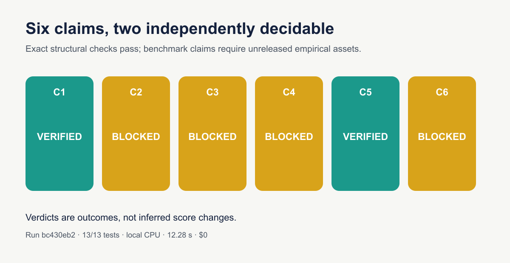
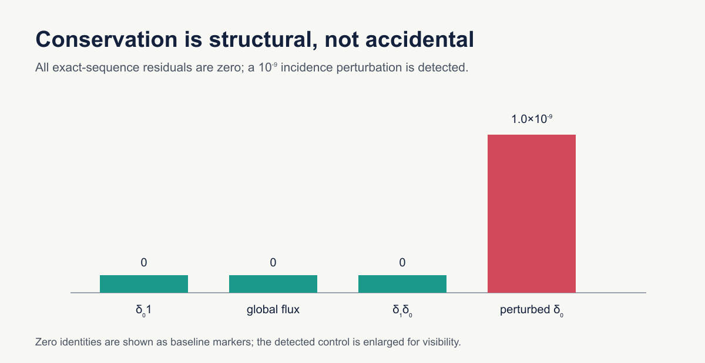
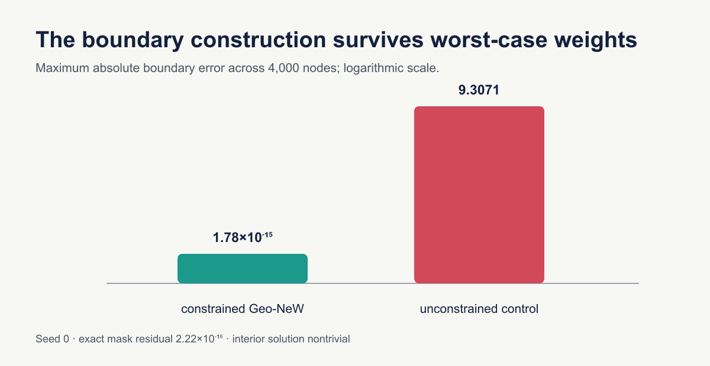
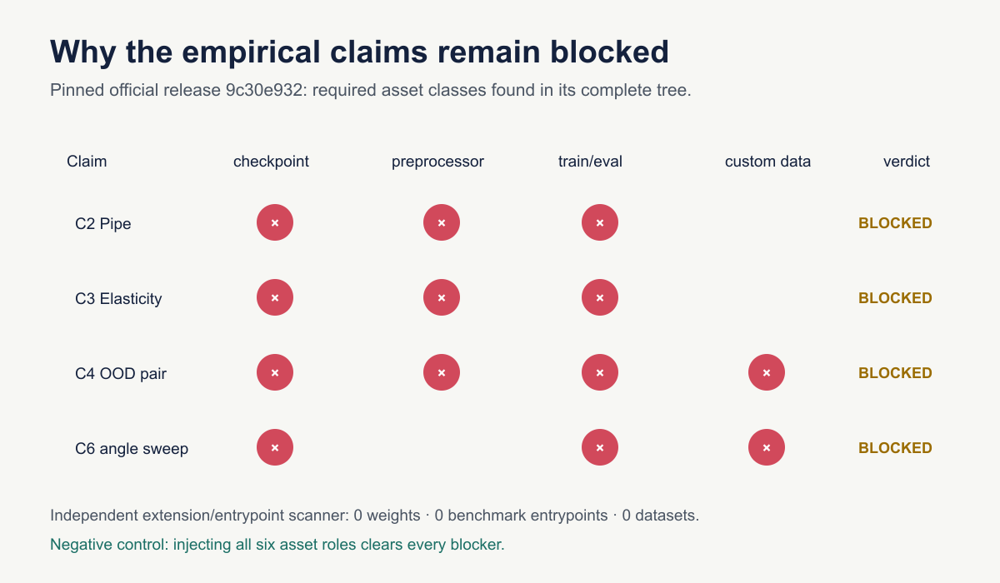

# Geo-NeW claim-by-claim reproduction



**Date:** 2026-07-23 · **Paper:** *Structure-Preserving Learning Improves Geometry Generalization in Neural PDEs* · **Compute:** local 8-core arm64 CPU

The paper asks whether a neural PDE solver can preserve mathematical structure
while generalizing to new geometries. This campaign could rigorously decide
the two architectural claims: conservation and exact Dirichlet enforcement
both survive independent checkers and adversarial controls. The four
benchmark claims cannot be decided from the public release: the required
trained weights, faithful preprocessors, and custom OOD data are absent.
They are marked `BLOCKED`, never substituted with toy evidence.

## Results first

| Claim | Paper result | Observed evidence | Verdict |
|---|---|---|---|
| C1 FEEC conservation | exact discrete conservation | every exact identity is zero; perturbed incidence is `1e-9` | **VERIFIED** |
| C2 Pipe | `0.112e-2` vs `0.38e-2` | no faithful Geo-NeW Pipe output can be generated | **BLOCKED** |
| C3 Elasticity | `0.351e-2` vs `0.50e-2` | no faithful Geo-NeW Elasticity output can be generated | **BLOCKED** |
| C4 Poly / NS2d-c++ OOD | `2.14` vs `4.60`; `42.2` vs `91.40` (x1e-2) | source values audited; empirical outputs unavailable | **BLOCKED** |
| C5 exact boundary values | `0.00` | `1.78e-15` constrained vs `9.3071` control | **VERIFIED** |
| C6 angled steps | Transolver degrades past 20°, Geo-NeW stable through 30° | custom angle data/models and numerical “meaningful” threshold unavailable | **BLOCKED** |

No new judge score is claimed. The live judge has not evaluated this revision.

## What was implemented

The cumulative entrypoint downloads the arXiv v2 source with an explicit User
Agent and rejects any hash other than
`c88523e66a538dc8001be383172f919aeac9e359e3c2294a26889c6ffc0ed724`.
It then executes the conservation verifier, exact-boundary verifier, source
metric audit, public-release inventory audit, and independent pytest suite.
Every verifier raises or exits nonzero on failed evidence.

The important code path is compact:

```text
run_all.py
  ├─ run_geo_new.py              → exact FEEC identities + perturbation
  ├─ verify_bc.py                → constrained BC + unconstrained control
  ├─ run_ood_metric_audit.py     → source-only metric/value audit
  ├─ run_release_asset_audit.py  → pinned public asset inventory
  └─ pytest                      → independent implementations and controls
```

The fixed command on every experiment node is:

```bash
uv sync --frozen && uv run python repro/src/run_all.py
```

## Exact structure checks



For `P ∈ {3,4,5,8,12}`, the incidence matrix satisfies
`δ₀1 = 0` exactly. Across 150 seeded random fluxes,
`1ᵀδ₀ᵀF = 0`, and an independent triangle construction gives
`δ₁δ₀ = 0`. An independently constructed complete-graph incidence agrees
with the implementation. Changing one matrix entry by `1e-9` immediately
breaks the zero residual, establishing that the result is structural rather
than a forgiving tolerance.



Across 4,000 boundary nodes and large seeded random weights, the constrained
field has maximum boundary error `1.776e-15`, while an unconstrained network
misses the prescribed data by `9.3071`. The distance/mask residual on the
boundary is `2.220e-16`, and the interior remains nontrivial.

## Why training was not replaced by a proxy



The authors' repository was pinned at
`9c30e9320428c10c9a4721c19a9bc0a1639b6716`. Its complete tree contains
the README, a demo, and four core source modules. It contains no checkpoint,
dataset, benchmark train/eval entrypoint, or faithful benchmark
preprocessor. The authors' Hugging Face namespace returned no models or
datasets. A second extension/entrypoint scanner reached the same result.

The standard Pipe and Elasticity raw arrays are public through the Geo-FNO
benchmark, but the paper's Geo-NeW conversion to mesh/FEM/Whitney inputs is
not. The custom processed Poly-Poisson OOD and NS2d-c++ COMSOL/Gmsh data are
also absent. The paper reports 5,000 Pipe and 10,000 Elasticity epochs on one
H200. CPU-downscaling any of these elements would test a different claim.
Hugging Face `cpu-upgrade` therefore was not used: more CPU cannot reconstruct
missing inputs.

As a non-vacuity check, the audit injects a synthetic complete manifest with
weights, preprocessing, train entrypoints, and both custom datasets. Every
blocker then clears. This control tests the blocker logic, not the paper.

## Source audit versus empirical evidence

The source audit confirms Table 1 and its mean per-sample normalized-L2
formula. It recomputes 53.478% reduction for Poly-Poisson against Linear
Attention. For NS2d-c++, the named Transolver comparison is 53.829%, while
the strongest listed alternative is actually GNOT at `83.08`, giving
49.206%. Those are transcription and arithmetic checks only; they neither
verify nor falsify trained-model performance.

The protected judged logbook included an older page calling a “65% MSE”
challenge statement falsified from source text. That page remains reachable
unchanged as historical evidence, but this campaign supersedes its empirical
interpretation: the exact benchmark claims remain `BLOCKED`.

## Experiment tree and reproducibility

| Node | Branch | Purpose | Outcome |
|---|---|---|---|
| Validated baseline | `orx/validated-4-12-baseline` | freeze accepted C1/C5 evidence and uv lock | done, 10 tests |
| Claim contracts / asset audit | `orx/exact-claim-contracts-and-public-asset-audit` | exact contracts, release inventory, cumulative regressions | done, 13 tests |
| Durable release candidate | `orx/durable-evidence-and-release-candidate` | package evidence, report, notebook, additive logbook | final gate node |

Successful evidence run `bc430eb2-ddfb-4bee-9711-de47f41cf4e5` used Git
`5533c695765767ab00cffd30bce03e19420c0781`, Python 3.12.11, seed 0,
and finished in 12.279662 seconds on the local CPU at $0. The earlier run
`d1506da1-5f5b-49cc-b36a-63efdbe3da48` stopped before the asset stage
because one CLI reader still used a renamed JSON key; the narrow fix was
rerun successfully.

## Assessment

The reproduction preserves the honest current boundary of the evidence:
Claims 1 and 5 are rigorously `VERIFIED`; Claims 2, 3, 4, and 6 are
rigorously `BLOCKED`. Full-scale resolution needs the authors' exact
preprocessors, custom datasets, configurations, and checkpoints—or enough
released detail to reproduce those assets—followed by multi-seed evaluation
under the paper's splits and metric. No perfect score is promised, and no
score increase is asserted before a new live-judge verdict.
